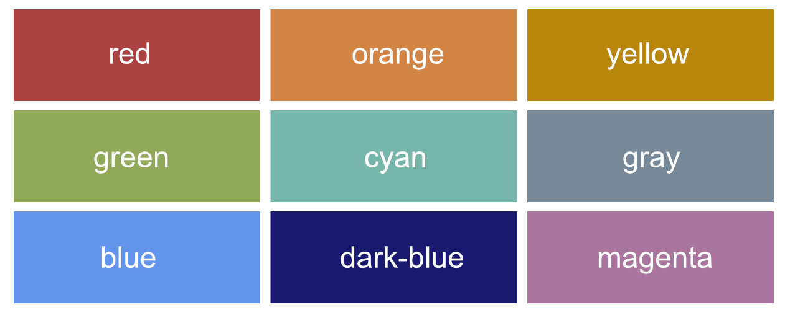

# Brown Institute Project Showcase Template

This showcase template was created to help Magic Grantees prepare for the Brown Institute fall showcase, and have a basic project website to document their project and process. The template is made from Jekyll, and is a modified version of the popular Hyde template.

[View a working demo of the website](https://browninstitute.github.io/showcase-template/)

In this README, we'll go through the process of setting up, editing and customizing this template for your project.

### Join our organization on Github

Before you get started, you'll need to make sure you are part of our team on Github. The Brown Institute has a [Github organization](https://github.com/browninstitute) where we will host the code for your showcase website. 

We will be granting you access to this organization, but if we have not added you yet, make sure you contact us for access.


## Set up the template

In order to use the template, go through the following steps.

1. Clone the repo

    Open a terminal window.
    
    On your command line, navigate to a folder where you'd like this project to live. If you want it to live in `Documents/BrownInstitute` then just type `cd Documents/BrownInstitute` on the command line then press `return`.

    Then, close the repository by pasting `git clone https://github.com/browninstitute/showcase-template.git` on your command line and pressing enter.
    
    Navigate into the cloned directory with `cd showcase-template`.
    
    Leave the terminal window open.

2. Create a new repository for your site within the Brown Institute's Github organization

    Go to our Github homepage at `https://github.com/browninstitute` and press the green `New` button on the right side of the screen.
    
    Name your repository with a hyphenated schema of `name of project` + `showcase` + `year`. So if we were making a repo for Open Contractors for the 2016 showcase, it would look like `open-contractors-showcase-2016`
    
    Make sure the repository will be public.
    
    Do *not* select `Initialize this repository with a README`
    
    Press `Create repository`
    
3. Add the template your new git respository

    Once you have initialized the repository, Github will provide you a repository link, like `https://github.com/browninstitute/open-contractors-showcase-2016.git`
    
    Go back to your terminal window. Copy and paste the following and press `return`.
    
    `git remote set-url https://github.com/browninstitute/YOUR-REPOSITORY-NAME`
    
    Now, add your files. On your command line:
      
      1. `git add .`
      
      2. `git commit -m 'adding files'`
      
      3. `git push origin master`
      
At this point all of your files should be added to your repository on Github. To make a visitable webpage out of this code, go to the `Settings` tab in your repository. Scroll down. Under the heading `Github pages` select `Master branch` under the dropdown menu and press `Save`. 

Wait a minute, then navigate to `browninstitute.github.io/YOUR-REPOSITORY-NAME` and a webpage should be there.
    


## Editing the website content 

If you are familiar with editing static websites and using Github, feel free to edit this template in the text editor of your choice.

If you haven't gone through this process before, I recommend using [Prose](http://prose.io/), a text editor that hooks into your Github account and is particularly great for editing Jekyll sites. 

Authorize Prose for your Github account, then find and click into your project repo. 

The main sections for the site can be found in the `pages` folder. They are written in Markdown, a flexible and fun markup language. If you are unfamiliar with using Markdown syntax, [this guide](https://daringfireball.net/projects/markdown/syntax) from Daring Fireball is particularly useful.

Once you edit the page in prose, you can click the save button on the right of the page to commit the changes straight to your web page.


## Editing the sticky sidebar content

To change the information in the sticky sidebar, open the `_config.yml` file in Prose. The sample config file looks like this:


```yml
  title:            'Your Project Name'
  tagline:          'Create a snappy tagline here'
  description:      'An online <a href="https://github.com/opencontractors" target="_blank">open-source</a> resource for media innovation projects.'
  url:              'http://yourProjectWebsite'
  baseurl:          /

  author:
    name:           'Your name here'
    url:            'https://twitter.com/yourTwitterName'

  social:
    - type:         'github'
      url:          'https://github.com/yourProjectGithub'
    - type:         'twitter'
      url:          'https://twitter.com/yourProjectTwitter'
```

This config file will provide a number of options that will change the content of the sidebar. Make sure you change them to suit your project.


## Themes

The config file for this theme lets you easily change the color scheme of your choice.


There are currently nine possible theme colors



To use a theme, go back to your config file and add a parameter to the `base-theme` option.

```yml
  base-theme: 'red'
```

If you'd like to create your own theme, look to the Themes section of [included CSS file](https://github.com/poole/hyde/blob/master/public/css/hyde.css). Copy any existing theme (they're only a few lines of CSS), rename it, and change the provided colors.


## Reverse layout


Hyde's page orientation can be reversed with a single change to the `_config.yml` file.

```yml
  reverse: 'layout-reverse'
```


---

### Hyde Author:

**Mark Otto**
- <https://github.com/mdo>
- <https://twitter.com/mdo>


### Altered by Allison McCartney

### License

Open sourced under the [MIT license](LICENSE.md).

<3
